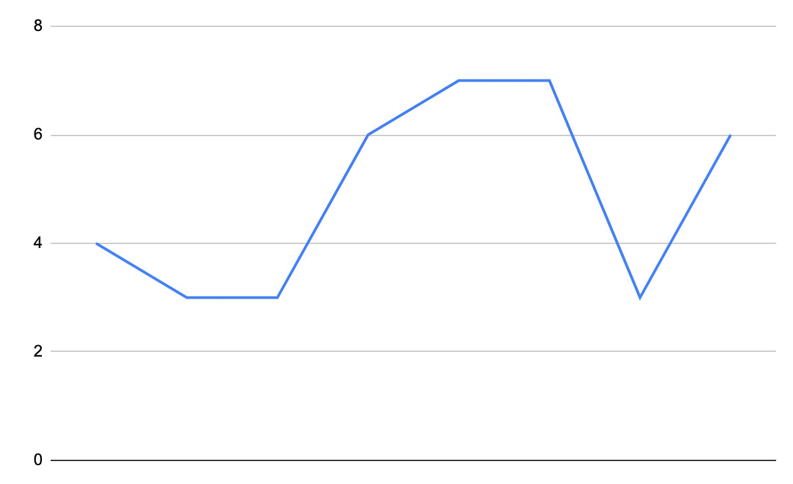

<!-- You should give this document a good title which describes the topic: -->
# 2021-topic-template

<!-- It's always a good idea to start with an image. For example, you could take a screenshot of your work and place it in the images directory of this repository: -->

## Topic

<!-- In this section, you can describe the topic you and your team have worked on. You can include images, links and everything else supported by the Markdown syntax. Try to make this section not much longer than three or four paragraphs. -->

## Team

<!-- A brief introduction about your team. Make it playful :) -->

<!-- This section includes a mandatory table that lists the names of all team members and links to their profile pages:  -->
| Team                                                             |
|:-----------------------------------------------------------------|
| [Name of first team member](team/name-of-first-team-member.md)   |
| [Name of second team member](team/name-of-second-team-member.md) |

## Locations

<!-- Start with a description about why these locations are chosen and why they are important for this topic. -->

<!-- This section also includes a mandatory table, this table lists each location and links to their Wikidata items: -->
| Locations                                        |
|:-------------------------------------------------|
| [Oaxaca](https://www.wikidata.org/wiki/Q131429)  |
| [Twente](https://www.wikidata.org/wiki/Q1455944) |
| [Cape Town](https://www.wikidata.org/wiki/Q5465) |

## Datasets

| Name     | URL        | Location
|:---------|:-----------|:-----------------
| 1        |            |
| 2        |            |

## Final result

<!-- Include a short description about what you've made, your approach, and how you've used the datasets listed above. And, most importantly, include a link to your work. Important: only include one link in this section! -->
