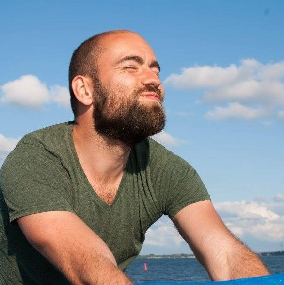

# Laurens
<!-- Fill in information between these brackets[]. You can delete the brackets and this comments when you are done. We'll use this information for the project website. You can update this info whenever you like :) -->

I am a teacher and a programmer working on educational projects.

## About me

<!-- This section includes a mandatory table with some questions and answers about yourself. You can add more questions and answers if you like! -->
| Question                             | Answer                                             |
|:-------------------------------------|----------------------------------------------------|
| Where do you live?                   | [Barcelona](https://www.wikidata.org/wiki/Q1492) |
| What is your field of study?         | Communication and Multimedia Design                                   |
| What was your role in your group?    | [Short text]                                       |
| Where can we find you online?        | [Link to website](https://website)                 |

## [More about yourself]
[If you want you can write more about who you are and your experience with this project]
[For example, you can write something about what made you choose this project, or about something you learned during this project about working with data?]
